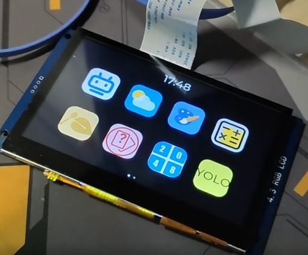

# 功能

一个基于imx6ull的支持对话的桌面机器人：

- 对话--有动画效果
- 桌面天气时钟
- 2048小游戏
- 日历
- 木鱼
- 猜数字
- 计算器
- 画板
- 设置菜单


# 效果




其它更多详情可以看演示视频：https://www.yuque.com/yeke5166226/github/stm32?singleDoc# 


# 介绍

主要是在电脑部署运行模型，各文件夹介绍：

```
AIChat/
├── Client/                # 开发板上的程序
├── Server/                # 模型

DeskBot/
├── conf/                  # 系统设置
├── gui_app/               # UI层的软件
│   ├── common/            # UI层扩展lib
│   ├── font/              # UI字体
│   ├── images/            # UI图片
│   ├── pages/             # UI层主要pages
│   └── ui.c/h             # 
├── lvgl/                  # lvgl核心组件
├── utils                  # 其他
├── lv_conf.h              # lvgl设置
└── main.c
```

开发板和电脑部署的模型主要通过Websocket和json进行通信

运行可看文件夹下的md文档


# buildroot基本配置

支持各类linux开发板，但需要自行构建根文件系统

```
book@100ask:~/100ask_imx6ull-sdk/Buildroot_2020.02.x$ cat .config | grep ^BR2_PACKAGE_
BR2_PACKAGE_OVERRIDE_FILE="$(CONFIG_DIR)/local.mk"
BR2_PACKAGE_HAS_TOOLCHAIN_EXTERNAL=y
BR2_PACKAGE_PROVIDES_TOOLCHAIN_EXTERNAL="toolchain-external-custom"
BR2_PACKAGE_HOST_GDB_ARCH_SUPPORTS=y
BR2_PACKAGE_BUSYBOX=y
BR2_PACKAGE_BUSYBOX_CONFIG="package/busybox/busybox.config"
BR2_PACKAGE_BUSYBOX_CONFIG_FRAGMENT_FILES=""
BR2_PACKAGE_SKELETON=y
BR2_PACKAGE_HAS_SKELETON=y
BR2_PACKAGE_PROVIDES_SKELETON="skeleton-init-sysv"
BR2_PACKAGE_SKELETON_INIT_COMMON=y
BR2_PACKAGE_SKELETON_INIT_SYSV=y
BR2_PACKAGE_FFMPEG_ARCH_SUPPORTS=y
BR2_PACKAGE_JACK2=y
BR2_PACKAGE_JACK2_LEGACY=y
BR2_PACKAGE_KODI_ARCH_SUPPORTS=y
BR2_PACKAGE_PULSEAUDIO_HAS_ATOMIC=y
BR2_PACKAGE_GDB_ARCH_SUPPORTS=y
BR2_PACKAGE_GOOGLE_BREAKPAD_ARCH_SUPPORTS=y
BR2_PACKAGE_KVM_UNIT_TESTS_ARCH_SUPPORTS=y
BR2_PACKAGE_LTP_TESTSUITE_ARCH_SUPPORTS=y
BR2_PACKAGE_LTRACE_ARCH_SUPPORTS=y
BR2_PACKAGE_OPROFILE_ARCH_SUPPORTS=y
BR2_PACKAGE_PTM2HUMAN_ARCH_SUPPORTS=y
BR2_PACKAGE_TCF_AGENT_ARCH="arm"
BR2_PACKAGE_TCF_AGENT_ARCH_SUPPORTS=y
BR2_PACKAGE_TRINITY_ARCH_SUPPORTS=y
BR2_PACKAGE_VALGRIND_ARCH_SUPPORTS=y
BR2_PACKAGE_CMAKE_ARCH_SUPPORTS=y
BR2_PACKAGE_PROVIDES_HOST_GETTEXT="host-gettext-tiny"
BR2_PACKAGE_NETSURF_ARCH_SUPPORTS=y
BR2_PACKAGE_QT5_JSCORE_AVAILABLE=y
BR2_PACKAGE_CPUBURN_ARM_ARCH_SUPPORTS=y
BR2_PACKAGE_FLASHROM_ARCH_SUPPORTS=y
BR2_PACKAGE_INPUT_EVENT_DAEMON=y
BR2_PACKAGE_SEDUTIL_ARCH_SUPPORTS=y
BR2_PACKAGE_HOST_ERLANG_ARCH_SUPPORTS=y
BR2_PACKAGE_ERLANG_ARCH_SUPPORTS=y
BR2_PACKAGE_GAUCHE_ARCH_SUPPORTS=y
BR2_PACKAGE_PROVIDES_HOST_LUAINTERPRETER="host-lua"
BR2_PACKAGE_LUAJIT_ARCH_SUPPORTS=y
BR2_PACKAGE_HOST_MONO_ARCH_SUPPORTS=y
BR2_PACKAGE_MONO_ARCH_SUPPORTS=y
BR2_PACKAGE_NODEJS_ARCH_SUPPORTS=y
BR2_PACKAGE_HOST_OPENJDK_BIN_ARCH_SUPPORTS=y
BR2_PACKAGE_OPENJDK_ARCH_SUPPORTS=y
BR2_PACKAGE_ALSA_LIB=y
BR2_PACKAGE_ALSA_LIB_DEVDIR="/dev/snd"
BR2_PACKAGE_ALSA_LIB_PCM_PLUGINS="all"
BR2_PACKAGE_ALSA_LIB_CTL_PLUGINS="all"
BR2_PACKAGE_ALSA_LIB_ALOAD=y
BR2_PACKAGE_ALSA_LIB_MIXER=y
BR2_PACKAGE_ALSA_LIB_PCM=y
BR2_PACKAGE_ALSA_LIB_RAWMIDI=y
BR2_PACKAGE_ALSA_LIB_HWDEP=y
BR2_PACKAGE_ALSA_LIB_SEQ=y
BR2_PACKAGE_ALSA_LIB_UCM=y
BR2_PACKAGE_ALSA_LIB_ALISP=y
BR2_PACKAGE_ALSA_LIB_OLD_SYMBOLS=y
BR2_PACKAGE_FDK_AAC_ARCH_SUPPORTS=y
BR2_PACKAGE_LIBSAMPLERATE=y
BR2_PACKAGE_LIBSNDFILE=y
BR2_PACKAGE_OPENAL_ARCH_SUPPORTS=y
BR2_PACKAGE_OPUS=y
BR2_PACKAGE_PORTAUDIO=y
BR2_PACKAGE_PORTAUDIO_ALSA=y
BR2_PACKAGE_WEBRTC_AUDIO_PROCESSING_ARCH_SUPPORTS=y
BR2_PACKAGE_ZLIB_NG_ARCH_SUPPORTS=y
BR2_PACKAGE_ZLIB=y
BR2_PACKAGE_LIBZLIB=y
BR2_PACKAGE_HAS_ZLIB=y
BR2_PACKAGE_PROVIDES_ZLIB="libzlib"
BR2_PACKAGE_PROVIDES_HOST_ZLIB="host-libzlib"
BR2_PACKAGE_BOTAN_ARCH_SUPPORTS=y
BR2_PACKAGE_LIBGPG_ERROR_ARCH_SUPPORTS=y
BR2_PACKAGE_LIBGPG_ERROR_SYSCFG="arm-unknown-linux-gnueabi"
BR2_PACKAGE_PROVIDES_HOST_OPENSSL="host-libopenssl"
BR2_PACKAGE_MONGODB_ARCH_SUPPORTS=y
BR2_PACKAGE_FREETYPE=y
BR2_PACKAGE_JPEG_SIMD_SUPPORT=y
BR2_PACKAGE_LIBDRM=y
BR2_PACKAGE_LIBDRM_HAS_ATOMIC=y
BR2_PACKAGE_LIBPNG=y
BR2_PACKAGE_WEBKITGTK_ARCH_SUPPORTS=y
BR2_PACKAGE_WPEWEBKIT_ARCH_SUPPORTS=y
BR2_PACKAGE_GNU_EFI_ARCH_SUPPORTS=y
BR2_PACKAGE_TSLIB=y
BR2_PACKAGE_SPIDERMONKEY_ARCH_SUPPORTS=y
BR2_PACKAGE_SPIDERMONKEY_JIT_ARCH_SUPPORTS=y
BR2_PACKAGE_JSON_C=y
BR2_PACKAGE_JSONCPP=y
BR2_PACKAGE_LIBOPENH264_ARCH_SUPPORTS=y
BR2_PACKAGE_CANFESTIVAL_ARCH_SUPPORTS=y
BR2_PACKAGE_LIBCURL=y
BR2_PACKAGE_LIBCURL_PROXY_SUPPORT=y
BR2_PACKAGE_LIBCURL_COOKIES_SUPPORT=y
BR2_PACKAGE_LIBCURL_EXTRA_PROTOCOLS_FEATURES=y
BR2_PACKAGE_LIBCURL_TLS_NONE=y
BR2_PACKAGE_RTMPDUMP=y
BR2_PACKAGE_WEBSOCKETPP=y
BR2_PACKAGE_BOOST=y
BR2_PACKAGE_BOOST_LAYOUT_SYSTEM=y
BR2_PACKAGE_BOOST_LAYOUT="system"
BR2_PACKAGE_BOOST_ATOMIC=y
BR2_PACKAGE_BOOST_CHRONO=y
BR2_PACKAGE_BOOST_CONTEXT_ARCH_SUPPORTS=y
BR2_PACKAGE_BOOST_DATE_TIME=y
BR2_PACKAGE_BOOST_SYSTEM=y
BR2_PACKAGE_BOOST_THREAD=y
BR2_PACKAGE_JEMALLOC_ARCH_SUPPORTS=y
BR2_PACKAGE_LIBATOMIC_OPS_ARCH_SUPPORTS=y
BR2_PACKAGE_LIBBSD_ARCH_SUPPORTS=y
BR2_PACKAGE_LIBNSPR_ARCH_SUPPORT=y
BR2_PACKAGE_LIBPTHREAD_STUBS=y
BR2_PACKAGE_LIBSECCOMP_ARCH_SUPPORTS=y
BR2_PACKAGE_LIBSIGSEGV_ARCH_SUPPORTS=y
BR2_PACKAGE_LIBUNWIND_ARCH_SUPPORTS=y
BR2_PACKAGE_LIBURCU_ARCH_SUPPORTS=y
BR2_PACKAGE_LLVM_ARCH_SUPPORTS=y
BR2_PACKAGE_LLVM_TARGET_ARCH="ARM"
BR2_PACKAGE_OPENBLAS_DEFAULT_TARGET="ARMV7"
BR2_PACKAGE_OPENBLAS_ARCH_SUPPORTS=y
BR2_PACKAGE_OPENBLAS=y
BR2_PACKAGE_OPENBLAS_TARGET="ARMV7"
BR2_PACKAGE_POCO_ARCH_SUPPORTS=y
BR2_PACKAGE_PROTOBUF_ARCH_SUPPORTS=y
BR2_PACKAGE_BITCOIN_ARCH_SUPPORTS=y
BR2_PACKAGE_QEMU_ARCH_SUPPORTS_TARGET=y
BR2_PACKAGE_HAPROXY_ARCH_SUPPORTS=y
BR2_PACKAGE_IFUPDOWN_SCRIPTS=y
BR2_PACKAGE_MONGREL2_LIBC_SUPPORTS=y
BR2_PACKAGE_XENOMAI_COBALT_ARCH_SUPPORTS=y
BR2_PACKAGE_AUDIT_ARCH_SUPPORTS=y
BR2_PACKAGE_EFIVAR_ARCH_SUPPORTS=y
BR2_PACKAGE_INITSCRIPTS=y
BR2_PACKAGE_SYSTEMD_ARCH_SUPPORTS=y
BR2_PACKAGE_SYSTEMD_BOOTCHART_ARCH_SUPPORTS=y
BR2_PACKAGE_XVISOR_ARCH_SUPPORTS=y
BR2_PACKAGE_HOST_E2FSPROGS=y
BR2_PACKAGE_HOST_GO_TARGET_ARCH_SUPPORTS=y
BR2_PACKAGE_HOST_GO_TARGET_CGO_LINKING_SUPPORTS=y
BR2_PACKAGE_HOST_GO_HOST_ARCH_SUPPORTS=y
BR2_PACKAGE_HOST_GO_BOOTSTRAP_ARCH_SUPPORTS=y
BR2_PACKAGE_HOST_GOOGLE_BREAKPAD_ARCH_SUPPORTS=y
BR2_PACKAGE_HOST_MKPASSWD=y
BR2_PACKAGE_HOST_PATCHELF=y
BR2_PACKAGE_HOST_QEMU_ARCH_SUPPORTS=y
BR2_PACKAGE_HOST_QEMU_SYSTEM_ARCH_SUPPORTS=y
BR2_PACKAGE_HOST_QEMU_USER_ARCH_SUPPORTS=y
BR2_PACKAGE_HOST_RUSTC_ARCH_SUPPORTS=y
BR2_PACKAGE_HOST_RUSTC_TARGET_ARCH_SUPPORTS=y
BR2_PACKAGE_HOST_RUSTC_ARCH="armv7"
BR2_PACKAGE_HOST_RUSTC_ABI="eabihf"
BR2_PACKAGE_PROVIDES_HOST_RUSTC="host-rust-bin"
BR2_PACKAGE_HOST_TI_CGT_PRU_ARCH_SUPPORTS=y
BR2_PACKAGE_HOST_UTIL_LINUX=y
BR2_PACKAGE_REFPOLICY_POLICY_VERSION=""
BR2_PACKAGE_TZDATA_ZONELIST=""
```

